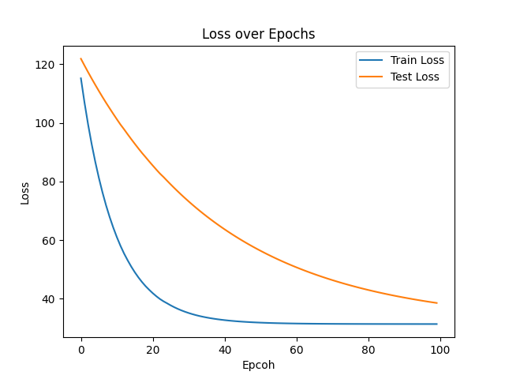
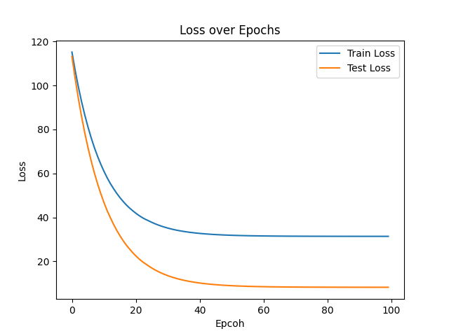
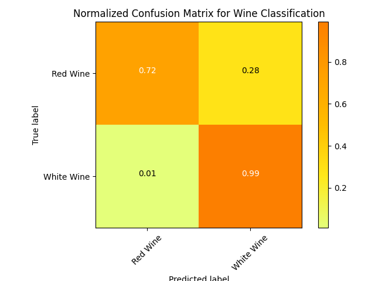

# Barebones RNN

This is a small project focused on how a Recurrent Neural Network functions. It was heavily inspired by [this](https://karpathy.github.io/2015/05/21/rnn-effectiveness/) blog from Andrej Karpathy.

This RNN uses a dataset of the various features of wine to predict the type of wine (red or white). The dataset was found [here](https://archive.ics.uci.edu/dataset/186/wine+quality).

## Demo

Running `make demo` in the root of the folder will compile the code. \
After that, running `./demo.out` will run the code. 

There are some functions used which are for linux, so it won't run on windows. 

### Output

It will train on the dataset for a 200 epochs, with around 2.5k observations per epoch. \
Afterwards it'll run a python script to create a few graphs.

It's interesting to note how the smooth loss for the *testing-set* reduces slower than the *training-set*, but this makes sense if you take into account how the smooth loss is being updated for both. \
The formula is: `smoothloss = 0.999 * smoothloss + 0.001 * softmax loss`, and since the *training-set* is bigger, it'll have more batches to update the smooth loss with, so it'll change faster than *testing-set*.

When the *testing-set* and *training-set* have the same amount of batches (but different sequence lengths), you can see an almost opposite effect, where the test loss drops faster than the train loss.

#### Example with different number of batches, but same sequence lengths

#### Example with different Sequence Lengths, but same amount of batches

#### Confusion Matrix

### Limitations

None of the variables have been whitened or normalized, so there are most likely some issues because of that.

## Other uses

Because the Gradient uses Softmax loss, it's only really ideal for classification tasks.

